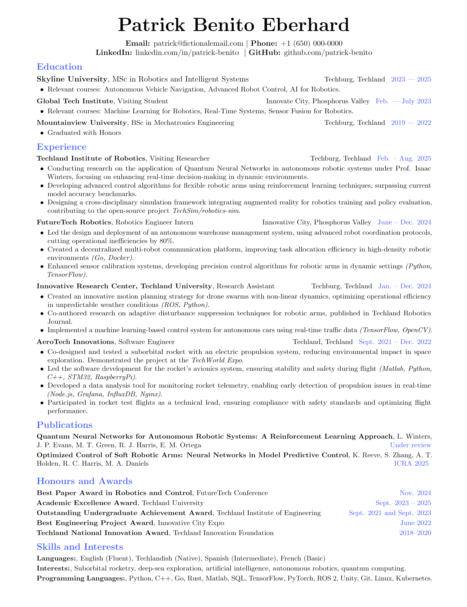

# Pat's Resume Template
A LaTeX template for your resume.

## Example

An example of the resume is provided in the [example.tex](example.tex) file. You can view a PDF example of the generated resume [here](example.pdf).

<p align="center">
    
</p>

## Usage

If you are using Overleaf, you can simply use the `\documentclass{pats-resume-template}` command. Otherwise, make sure to copy the `pats-resume-template.cls` file to your project directory.

```
/my-resume
├── pats-resume-template.cls
└── myresume.tex 
```

Then use the `pats-resume` class in your LaTeX document:

```latex
\documentclass{pats-resume-template}
\begin{document}
... Your resume content here ...
\end{document}
```

## Features
- 📝 You can set your name, address, phone number, and email in the preamble.
- 📄 You can add sections and entries to your resume.
- 📏 You can choose the file format of your resume (A4 or Letter).
- 💼 You can provide a `\tech` or `\consulting` command to show the relevant experience depending on the job you are applying for, by setting the `\def\techFlag{}` or `\def\consultingFlag{}` in the preamble.
- 🎓 Similarly, you can use ``\gpa` to show your GPA if the `\def\gpFlag{}` is set.
